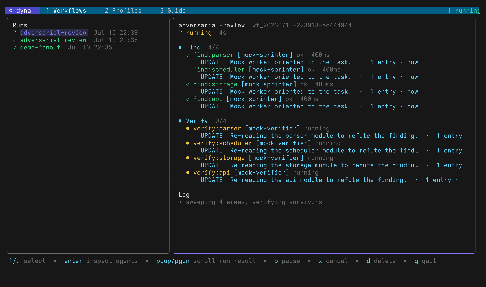
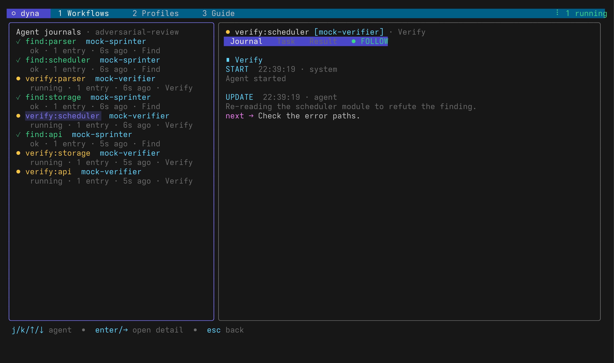
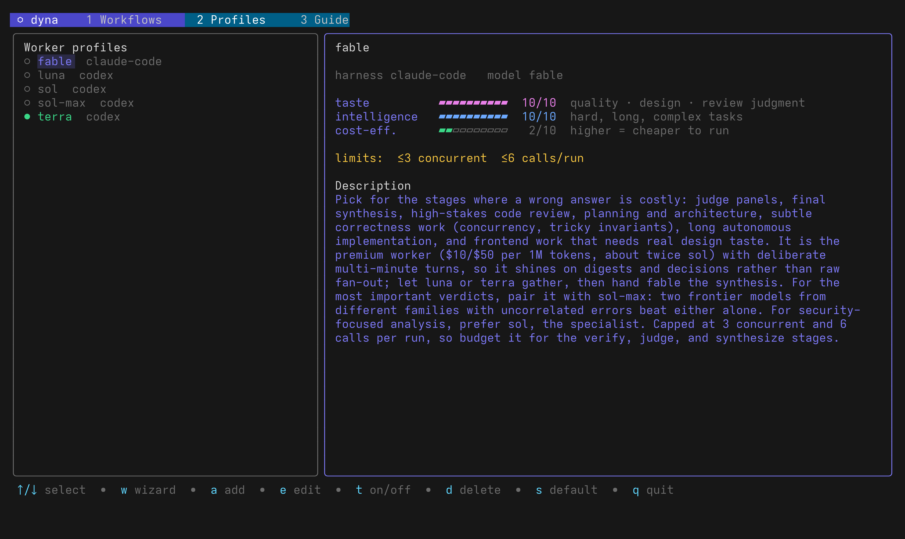

# dyna

Dynamic multi-agent workflows for any coding agent.

`dyna` is a standalone, harness-agnostic port of Claude Code's dynamic
workflow system. Any coding agent (claude-code, codex CLI, opencode, pi) can
write plain JavaScript workflow scripts that orchestrate fleets of model
workers deterministically, while humans configure the fleet and watch runs
live in a terminal dashboard.

```
┌─────────────┐   dyna run script.js    ┌──────────────────────────────┐
│ your agent  │ ──────────────────────▶ │ dyna engine (embedded JS)    │
│ (any CLI)   │ ◀── result JSON ─────── │ agent()/parallel()/pipeline()│
└─────────────┘                         └──────┬───────────────────────┘
                                               │ fans out to worker profiles
                              ┌────────────────┼────────────────┐
                              ▼                ▼                ▼
                        claude -p …      codex exec …     opencode run …
```



## Install

```bash
curl -fsSL https://raw.githubusercontent.com/arismoko/dyna-agent/main/install.sh | bash
```

The installer downloads a release binary, falls back to building from source,
and installs the agent skill into every detected harness. From a checkout,
`./install.sh` does the same (builds locally into `~/.local/bin`). Overrides:
`DYNA_INSTALL_DIR`, `DYNA_REPO`, `DYNA_VERSION`, `DYNA_NO_SKILLS=1`.

Then:

```bash
dyna profiles init        # register the curated default worker fleet
dyna demo                 # register mock workers and run a sample workflow
dyna tui                  # open the dashboard
```

## Teaching your agents about dyna

`dyna skill install` writes an agent skill (a SKILL.md with name/description
frontmatter) into every detected harness, so agents know dyna exists and to
read `dyna guide`:

- **claude-code**: `~/.claude/skills/dyna/SKILL.md`
- **codex**: `~/.codex/skills/dyna/SKILL.md`
- **opencode**: `~/.config/opencode/skills/dyna/SKILL.md`
- **pi**: `~/.pi/agent/skills/dyna/SKILL.md`

`dyna skill install <harness>` forces one, `--all` forces all,
`dyna skill uninstall` removes cleanly, and `dyna skill show` prints the
content. Older versions wrote managed AGENTS.md blocks; install and uninstall
migrate those away automatically.

## Worker profiles

You register the models agents are allowed to use, each with a description
and three standardized stats, all 1-10 where higher is better (for cost,
higher means cheaper):

- **taste**: code quality, judgment, design sense, review ability
- **intelligence**: raw capability on hard, long, complex tasks
- **cost**: cost efficiency (10 = very cheap to run, 1 = very expensive)

**Quick start:** `dyna profiles init` registers a curated default fleet:
`fable` (Claude Fable 5 via claude-code, for verification, judging,
high-stakes review, and frontend work), `sol` and `sol-max` (gpt-5.6-sol via
codex at high and max effort, for hard implementation and debugging), `terra`
(the balanced default generalist), and `luna` (cheap, fast sweeps). Each
description tells agents when to pick that worker, when to avoid it, and how
it tends to fail. Existing profiles are never overwritten unless you pass
`--force`.

Or build profiles interactively with the TUI's profile wizard (`w` on the
Profiles tab), six multiple-choice steps:

1. **Harness**: which CLI runs the worker
2. **Model**: fetched from the harness itself (`codex debug models`,
   `claude --help` model aliases, `opencode models`), or type it yourself
3. **Reasoning effort**: the levels that model actually supports, translated
   to the right flags and env vars on save
4. **Stats**: taste, intelligence, cost efficiency
5. **Description**: the blurb agents read when picking workers
6. **Finish**: name (auto-suggested), limits, enabled, default, save

Or register by hand:

```bash
dyna profiles add --name sol --harness codex --model gpt-5.6-sol \
  --extra-arg '-c' --extra-arg 'model_reasoning_effort=high' \
  --taste 7 --intelligence 9 --cost 6 \
  --desc "Workhorse for hard implementation and debugging. Works boldly; pin the scope on legacy code."

dyna profiles add --name fable --harness claude-code --model fable \
  --taste 10 --intelligence 10 --cost 2 \
  --desc "Premium reviewer and judge. Excellent taste; best for verification and high-stakes decisions."

dyna profiles add --name luna --harness codex --model gpt-5.6-luna \
  --taste 5 --intelligence 7 --cost 10 \
  --desc "Cheap and fast. Ideal for wide fan-outs, sweeps, and first-pass triage."
```

Profiles can be toggled on and off without losing anything:
`dyna profiles disable <name>` / `enable <name>` (TUI: `t`). A disabled
profile keeps its stats and description and stays editable, but disappears
from the agents' view, and any `agent()` call to it fails.

Supported harnesses: `claude-code`, `codex`, `opencode`, `pi`, `custom` (any
argv with `{{prompt}}`/`{{model}}` placeholders; the prompt goes to stdin if
no placeholder is given), and `mock` for demos and tests. Workers run
headless (`claude -p`, `codex exec`, `opencode run`) in the workflow's
working directory, so they can read and edit files.

**Permissions are bypassed by default** unless a profile supplies an explicit
permission or sandbox mode: claude-code workers get
`--dangerously-skip-permissions` and codex workers get
`--dangerously-bypass-approvals-and-sandbox`, because a headless worker that
stops to ask for permission hangs forever. Register a profile with
`--safe-mode` to keep the harness's own guardrails, and add other
harness-specific flags with `--extra-arg`.

If a built-in harness exits unsuccessfully or loses its final output after
establishing a session, dyna waits briefly and nudges that exact session once
to finish the original task. The retry stays inside the original timeout and
logical `agent()` call. Cancellation is never retried, and profiles with
explicit persistence, session, budget, or resume-incompatible flags (and
custom harnesses) stay single-shot so recovery cannot silently change those
controls.

Agents discover the fleet with `dyna profiles list --json` and pick workers
by description and stats, or dynamically inside scripts via the `profiles`
global.

Profiles can also be limited so agents can't lean on an expensive model too
hard: `--limit-concurrent N` caps simultaneous workers of that profile
(excess calls queue), and `--limit-calls N` hard-caps total calls per run.
The first call past a call cap aborts the whole workflow with a clear error
rather than continuing toward a silently degraded (but still billed) result.
Limits show up in `profiles list` and in the scripts' `profiles` global, so
agents can size fan-outs around them up front.

## For agents

Point your agent at the guide; it contains the full script API and the
orchestration patterns (adversarial verify, judge panel, loop-until-dry,
cheap-first triage):

```bash
dyna guide --plain
```

Then:

```bash
dyna run review.js --args '{"target":"src/"}'   # progress on stderr, result JSON on stdout
dyna run audit.js --detach                      # background; prints the run id
dyna journal "mapped the parser boundary" --kind finding --next "check callers"
dyna runs wait <id>                             # block until done, print the result
dyna run review.js --resume <id>                # replay unchanged agent calls from a prior run
dyna runs list                                  # inspect history
dyna runs cancel <id>                           # stop a running workflow
dyna runs pause <id> / unpause <id>             # hold new worker launches / resume
dyna runs remove <id>... / clear                # delete finished runs
```

Cancel, pause, and delete are also available in the TUI (`x`, `p`, `d` on the
Workflows tab).

Per-agent `isolation: 'worktree'` runs a worker in a detached git worktree,
removed automatically if untouched and kept (with its path logged) if the
worker changed files.

Every run persists under `~/.local/share/dyna/runs/<run-id>/`:

```text
script.js                        # captured workflow
meta.json                        # run status and timestamps
events.jsonl                     # live run/agent event stream
journal.jsonl                    # completed-call/resume ledger
agents/<agent-id>/journal.jsonl  # that worker's live progress journal
result.json                      # final workflow value
```

The root `journal.jsonl` holds the completed-call records (including prompts
and results) used by workflow resume; it is not the live progress journal.
Every live worker, including a read-only explorer, gets its own run-owned
`agents/<agent-id>/journal.jsonl`.

## Agent journals

Dyna prepends journal instructions to every worker prompt. During a run the
worker records concise progress notes with:

```bash
dyna journal "confirmed the decoder rejects truncated input" \
  --kind verification --next "report the evidence"
```

`--kind` is one of `update`, `finding`, `decision`, `verification`, or
`blocker`; `--next` is optional. Dyna supplies the timestamp and agent
identity and serializes appends so concurrent writes cannot corrupt a line.
An agent-authored line is a complete JSON object followed by a newline:

```json
{"ts":1783706645123,"kind":"finding","message":"Located the retry boundary.","next":"Inspect cancellation behavior.","source":"agent"}
```

`ts` is Unix time in milliseconds. `message` is a non-empty progress note and
`next` is optional. Dyna may also append system start, nudge, and completion
records with extra metadata. Each physical line is independently valid JSON;
the file is JSONL, not a single JSON array.

Orchestrators should reinforce the cadence in worker prompts: write once
after orientation, at meaningful discoveries, decisions, verifications, and
blockers, before a long operation, and before finishing. Entries should say
what changed and what comes next, in one or two sentences plus an optional
next step. They are not chain-of-thought, scratchpads, command transcripts,
or a substitute for the final answer.

This applies to read-only exploration too: the worker treats its run-owned
journal as its only allowed write. When a codex profile explicitly selects a
read-only sandbox or a built-in read-only permission profile, dyna preserves
that boundary and layers a narrow permission profile that makes only the
agent's journal directory writable. It does not turn the target workspace
writable or silently disable the read-only sandbox. Other provider-managed or
custom read-only modes are never auto-bypassed; if they cannot expose a
narrow journal exception, dyna records the missing entry instead of widening
access.

After five minutes without a valid agent-authored entry, dyna marks the
worker quiet. For resumable built-in harnesses it gracefully interrupts,
allows the CLI to flush its session, and continues the exact same session
with a reminder to write now and keep working; it never launches a fresh
worker. Explicitly non-resumable sessions and custom harnesses can be shown
as quiet, but cannot be safely live-resumed.

A resumable worker that finishes quickly without writing anything gets one
bounded, immediate reminder in that same session to add a brief entry; its
already-successful task result stays authoritative. If a custom or explicitly
non-resumable worker finishes without an entry, dyna records that the
reminder was unavailable rather than risking a duplicate fresh invocation.

The journal is a progress side channel. A final response still has to satisfy
the `schema` passed to `agent()` (when present); journal JSONL never counts
as or replaces that result.

## The TUI

`dyna tui` has three views; switch with `tab` or `1`/`2`/`3`:

- **Workflows**: every run, with active agents visible. Inspect a run for a
  journal-first live timeline and per-agent **Journal**, **Task**, and
  **Result** modes. Agent rows show lifecycle status, journal-entry count,
  relative freshness, and whether a quiet-worker nudge was sent. Press
  `enter` or `right` to focus, `left`/`right` to change mode, `j`/`k` or
  arrows to scroll, `g`/`G` for top/bottom, `f` to follow new entries, and
  `esc` to return to the agent list. The selected run's events, completion
  ledger, and selected agent journal are tailed independently about every
  400 ms, so entries appear while the worker is still running, not only when
  it finishes.

  
- **Profiles**: the fleet at a glance, with descriptions and
  taste/intelligence/cost stat bars. `a` add, `e` edit, `d` delete, `s` set
  default, `t` toggle enabled, `w` wizard.

  
- **Guide**: the scripting guide, rendered.

## Script example

```js
export const meta = { name: 'fix-and-check', phases: [{title:'Fix'},{title:'Check'}] }

phase('Fix')
const fix = await agent(`Fix the failing test in ${args.pkg}. Edit files as needed.`,
  { profile: 'sol', label: 'fix' })

phase('Check')
const verdict = await agent(
  `Review the working-tree diff. Was the fix correct and minimal? ${fix}`,
  { profile: 'fable', label: 'review', schema: { type:'object', required:['ok'],
    properties: { ok: {type:'boolean'}, notes: {type:'string'} } } })

return { verdict }
```

See `examples/` for adversarial-review and judge-panel workflows, and
`dyna guide` for the full API.

## Layout

- `main.go`: CLI (cobra): `profiles`, `run`, `runs`, `journal`, `guide`,
  `tui`, `demo`, `skill`
- `internal/engine`: embedded JS runtime (goja plus an event loop),
  concurrency semaphore, JSON-schema-validated structured output with
  auto-retry
- `internal/harness`: headless CLI adapters with bounded, exact-session
  recovery for transient harness failures
- `internal/profile`: profile registry (`~/.config/dyna/profiles.json`)
- `internal/runstore`: run persistence, event stream, completed-call ledger,
  and per-agent journals
- `internal/tui`: Bubble Tea dashboard
- `guide/GUIDE.md`: the agent-facing scripting guide (embedded in the binary)

## License

MIT
